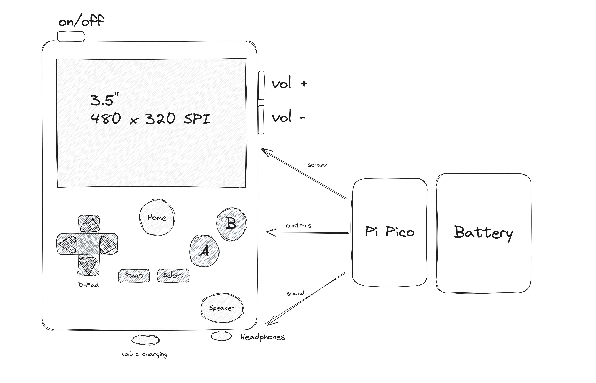
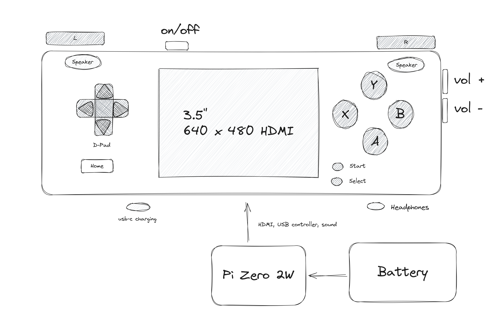

My brain has been going over the different options of what reference
hardware to use. And I think the correct approach is to keep it simple (stupid).
For the purposes of DashGL, my focus is on one device but it helps
to consider what other options there could be when defining the boundaries
for the aspects I want to focus on.

## Three Devices

The three devices boil down to the following outlines

### Lite Version 

- 3.5" 480 x 320 SPI display
- D-pad, A, B, Start, Select, Home
- Mono Sound
- Pi Pico

### Advance Version

- 3.5" 640 x 480 HDMI display
- D-pad, A, B, X, Y, L, R, Start, Select, Home
- Stereo Sound
- Pi Zero 2w

### Pro Version 

- 5" 800 x 480 HDMI display
- D-pad, A, B, X, Y, L, R, L Trigger, R Trigher, Start, Select, Left Analog, Right Analog, Home
- Sterio Sound
- Pi CM4

## Version Confusion

The axiety I had was balancing the difference between the Advance and Pro models.
For the Lite version the Gameboy Color works as a reference device, and for the 
Pro there's the Switch as a reference device. 

But surprisingly there isn't a clean handheld version in the middle to reference. 
As in that range of generation we have the Gameboy Advance, NDS, PSP. Where the
Gameboy Advance is the closest device I want to emulate, but it doesn't have 4 face
buttons. And while the DS and PSP have the d-pad, shoulder buttons and four face buttons,
they also add mino tweaks into the equation.

Which is why there was the temptaton to include something small like a nub for a small
inclusion that could be used for light 3d. And it's very tempting as that means the layout
device could effectively used to emulate Dreamcast and PSP. And get into that weired uncanny
valley of those generations of experimental 3d. 

But I'm not sure if it makes any sense, as having one nub would create confusion around
what the device is supposed to be. As then it would then make sense to add another
nub, and then triggers as that's what it takes in terms of level of control to enjoy those
kinds of games. As well as the reference hardware being a Zero 2w doesn't make those kinds of
games viable to emulate anyways.

In this case, instead of providing a good 2d experience which is then confused by a poor
3d experience, it makes more sense to focus and deliver on an exelent 2d experience 
along with a long battery life for the device. 